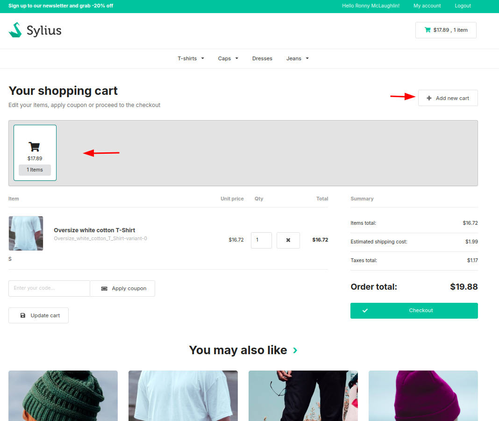
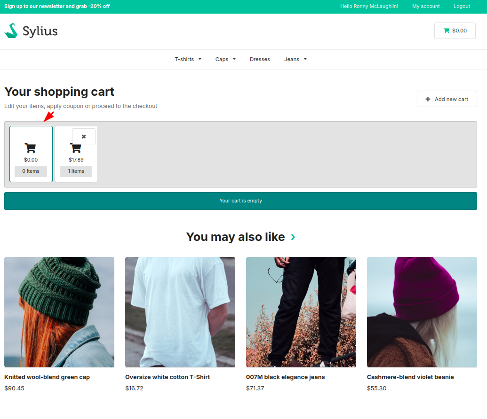
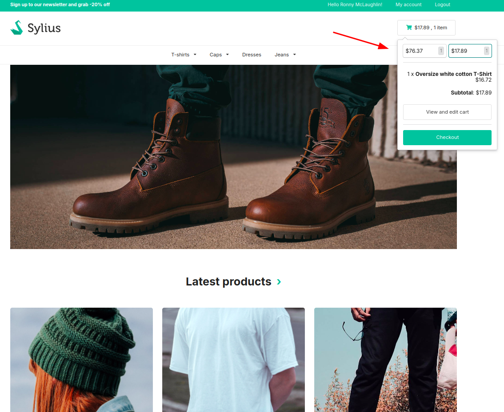

# Functionalities

---

This plugin allows users to create multiple carts for their own use.

After adding products to the first cart and viewing it, logged-in user has the possibility to add a new cart.

    

After creating it, user can switch between and view the contents of all created carts.

    

It is also possible to switch between carts in every shop view using mini cart.

    

